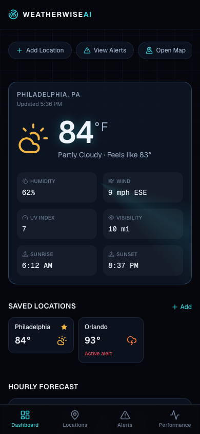
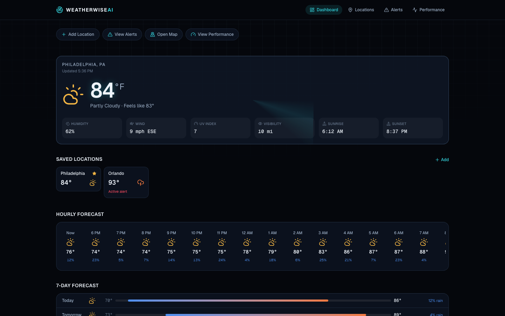
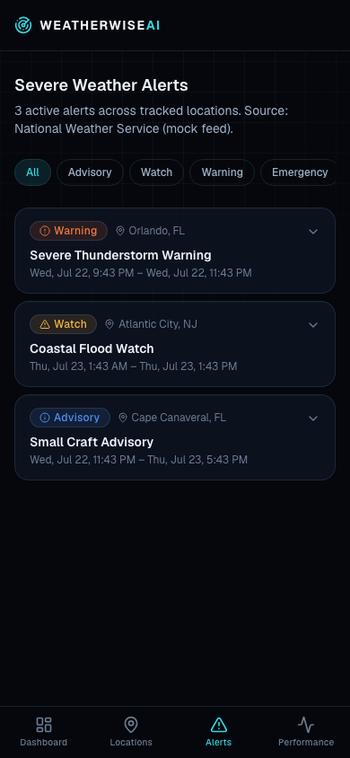
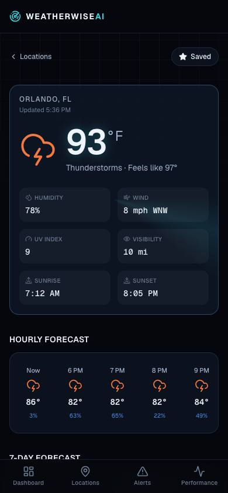
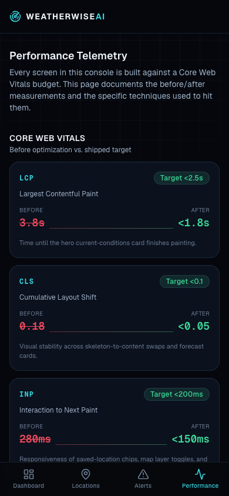

# WeatherWise AI — Storm Operations Console

**Live demo:** [weatherwise-ai-console.vercel.app](https://weatherwise-ai-console.vercel.app)

A mobile-first weather intelligence dashboard built as a senior frontend engineering portfolio piece. It's designed to look and behave like a product a company such as **The Weather Channel** would ship: alert-first design, map-driven interaction, offline resilience, and a documented Core Web Vitals optimization story — not a generic admin-dashboard template.

> Live weather, radar sweeps, and severe alerts are all served from a typed **mock provider** with realistic data shapes, so the app runs instantly with zero API keys and no billing risk, while staying one adapter away from a real weather API.

---

## Table of contents

- [Product overview](#product-overview)
- [Why this project exists](#why-this-project-exists)
- [Weather Channel relevance](#weather-channel-relevance)
- [Feature list](#feature-list)
- [Tech stack](#tech-stack)
- [Architecture overview](#architecture-overview)
- [Data flow](#data-flow)
- [Performance strategy](#performance-strategy)
- [Offline strategy](#offline-strategy)
- [Edge caching strategy](#edge-caching-strategy)
- [Map strategy](#map-strategy)
- [Screenshots](#screenshots)
- [Lighthouse report](#lighthouse-report)
- [Local setup](#local-setup)
- [Environment variables](#environment-variables)
- [Deployment to Vercel](#deployment-to-vercel)
- [Roadmap](#roadmap)
- [Lessons learned](#lessons-learned)

---

## Product overview

WeatherWise AI is a "Storm Operations Console" — a dark, high-contrast, radar-driven interface for tracking current conditions, hourly/7-day forecasts, severe weather alerts, and a live-feeling map across seven U.S. cities. It's built mobile-first with glass-panel cards, a rotating radar sweep, alert priority zones, and animated forecast cards, all while staying disciplined about Core Web Vitals.

## Why this project exists

Most weather-dashboard portfolio projects are generic CRUD-over-an-API demos. This one exists to demonstrate the things a senior frontend hire actually gets evaluated on:

- Server Components vs. Client Components used deliberately, not by default
- A real offline story (service worker + localStorage cache + dedicated offline UI), not just a checkbox
- A map feature that **cannot** crash the rest of the app, with a graceful, on-brand fallback
- A documented before/after performance narrative instead of a vague "it's fast" claim
- A provider abstraction so a mock data source can become a real API integration without touching UI code

## Weather Channel relevance

The product decisions mirror what a consumer weather product needs to get right on mobile web:

- **Alert-first hierarchy** — severe alerts are never buried; they appear on the dashboard, get their own page, and use a consistent severity taxonomy (Advisory → Watch → Warning → Emergency).
- **Glanceable, high-contrast UI** — legible in bright sunlight and at a glance, which is how people actually check the weather.
- **Resilience** — weather apps get used in exactly the conditions (storms, spotty connectivity) where the network is least reliable. Offline support isn't optional.
- **Map-centric mental model** — storms are spatial; the console leads with a radar-style map, not just a list of numbers.

## Feature list

**Home Dashboard** (`/`)
Hero current-conditions card, saved-location chips, hourly carousel, 7-day forecast, active-alert summary, weather map preview, performance snapshot, quick actions.

**Location Detail** (`/location/[slug]`)
Full current conditions, hourly/daily forecast, location-scoped alerts with expandable detail, activity recommendations, single-location map, offline/cached-data notice.

**Saved Locations** (`/locations`)
Add/remove/set-default saved cities, per-location alert badges, mini forecast cards, and **free-text search for any city worldwide** (not just the curated roster) via a keyless geocoding API — all persisted to `localStorage`.

**Alerts** (`/alerts`)
All active alerts across tracked cities, severity filter tabs, plain-English impact + recommended action, mock NWS-style source metadata, expandable `<details>`-based cards (zero JS required to expand).

**Performance** (`/performance`)
Core Web Vitals before/after table, Lighthouse score targets, bundle/cache metrics, cache-strategy breakdown, and the full optimization checklist.

**Offline** (`/offline`)
Explains offline mode, lists cached forecasts with timestamps, lets you clear stale cached data, and links back to the dashboard.

## Tech stack

| Layer | Choice |
| --- | --- |
| Framework | Next.js 16 (App Router, Turbopack) |
| UI | React 19, TypeScript, Tailwind CSS v4 |
| Data | Server Components + Route Handlers, typed mock weather provider |
| Caching | Edge `Cache-Control` headers, `localStorage`, Service Worker |
| Icons | `lucide-react` (tree-shaken, per-icon imports) |
| Offline | Custom Service Worker (no Workbox dependency) |
| Deployment | Vercel-ready, edge runtime on lightweight routes |

No paid APIs, no map SDK, no animation library — every visual (radar sweep, storm grid, map markers) is CSS/SVG built on Tailwind tokens.

## Architecture overview

```
app/
  layout.tsx              Root shell: fonts, metadata, AppShell, SW registration
  page.tsx                Home dashboard (Server Component)
  location/[slug]/         Location detail (SSG via generateStaticParams + per-request data)
  locations/               Saved locations (Server page → Client content island)
  alerts/                  Alerts (Server Component, URL-driven severity filter)
  performance/             Performance telemetry (Server Component, static content)
  offline/                 Offline fallback (Server page → Client content island)
  api/weather/route.ts     Edge route handler, cache headers
  api/alerts/route.ts      Edge route handler, cache headers
  api/geocode/route.ts     Edge route handler, proxies Open-Meteo's free geocoding API
  icon.tsx / apple-icon.tsx/ icons/*  Generated PWA icons (next/og ImageResponse, no binary assets)

components/
  ui/          Design-system primitives (Card, Badge, Button, Skeleton, AppShell, Navbar…)
  dashboard/   Home-dashboard sections (CurrentConditions, HourlyForecast, AlertSummary…)
  maps/        WeatherMap (dynamic, ssr:false) + WeatherMapClient + MapFallback + error boundary
  locations/   LocationSearch, SavedLocationCard, client page content islands
  alerts/      AlertCard, AlertSeverityBadge
  performance/ VitalsCard, PerformanceChecklist, LighthouseSummary

lib/
  weather/     types.ts, mockWeatherProvider.ts, weatherService.ts, cache.ts, locationSlug.ts
  performance/ vitals.ts — Core Web Vitals + Lighthouse target data
  storage/     useSyncExternalStore-backed stores for saved locations + cached entries
  utils.ts     cn() className merge, date/time formatting

hooks/
  useSavedLocations.ts   localStorage-backed saved-location state (useSyncExternalStore)
  useOnlineStatus.ts     navigator.onLine + online/offline events (useSyncExternalStore)
  useCachedWeather.ts    fetch-with-localStorage-fallback for a single location
```

**Server/Client boundary, deliberately:** every page is a Server Component by default. Interactivity (saved-location chips, the map, search, the offline banner) is isolated into small `"use client"` islands so the initial HTML for every route ships fully rendered, and the client JS bundle only pays for what's actually interactive.

## Data flow

1. `lib/weather/mockWeatherProvider.ts` generates deterministic, realistic weather data (current conditions, 24h hourly, 7-day daily, alerts, air quality) for seven cities, seeded so results are stable across requests.
2. `lib/weather/weatherService.ts` wraps the provider behind a `WeatherProvider` interface (`listLocations`, `getLocation`, `getSnapshot`, `listAlerts`). Server Components call this directly — no network hop.
3. `app/api/weather/route.ts` and `app/api/alerts/route.ts` expose the same service over HTTP (edge runtime, typed JSON, `Cache-Control` headers) for **client-side** consumers: saved-location chips, the locations page, and the offline-aware hook.
4. Client hooks cache successful responses into `localStorage` (`lib/weather/cache.ts`) so a location viewed once is available offline.

To go live: implement `WeatherProvider` against a real API (e.g. NWS or Open-Meteo) and swap the `activeProvider` in `weatherService.ts`. Nothing else changes.

### Adding any city, without a database

The curated 7-city roster has hand-authored data, but `/locations` search isn't limited to it — you can add **any city worldwide**:

1. `app/api/geocode/route.ts` proxies [Open-Meteo's geocoding API](https://open-meteo.com/en/docs/geocoding-api), which is free and requires no API key, to resolve a search query to name/coordinates/timezone.
2. `lib/weather/locationSlug.ts` encodes that location into a **self-describing slug** — a URL-safe base64 blob of `{name, region, country, lat, lon, timezone}` prefixed with `geo-`. There's no database: the slug *is* the record.
3. `mockWeatherProvider.ts` decodes the slug on demand and synthesizes a plausible forecast from it — temperature from latitude + time of year, condition from a temperature-appropriate pool, and an occasional generic alert — all seeded so it's stable per city per hour, exactly like the curated cities.
4. Everywhere else in the app (saved locations, the map, `/location/[slug]`, offline caching) only ever deals with a `slug` string, so none of it needed to change to support arbitrary cities.

The tradeoff: synthetic-city URLs are long and unpretty, and their forecasts are modeled, not measured — both called out in the UI copy on the search page.

## Performance strategy

| Metric | Before | After (target) | Good threshold |
| --- | --- | --- | --- |
| **LCP** (Largest Contentful Paint) | 3.8s | **< 1.8s** | < 2.5s |
| **CLS** (Cumulative Layout Shift) | 0.18 | **< 0.05** | < 0.1 |
| **INP** (Interaction to Next Paint) | 280ms | **< 150ms** | < 200ms |
| **TTFB** (Time to First Byte) | 620ms | **< 180ms** | < 800ms |

"Before" reflects a client-rendered baseline of this same dashboard (fetch-on-mount, no skeletons, unbounded map bundle in the main chunk). "After" reflects the techniques actually shipped in this repo:

- **Server Components for the initial shell** — dashboard, location, alerts, and performance pages render weather data server-side; no client fetch waterfall blocks first paint.
- **Edge cache headers on weather route handlers** — `app/api/weather` and `app/api/alerts` set `Cache-Control: public, s-maxage=300, stale-while-revalidate=600` (alerts use a shorter `s-maxage=120`).
- **Dynamic import for the map** — `WeatherMapClient` loads via `next/dynamic({ ssr: false })` from a client wrapper, keeping map code out of every page that doesn't render it eagerly.
- **Skeleton UI with reserved dimensions** — every `loading.tsx` and client fetch state uses fixed-height skeletons matching final content.
- **Stable card dimensions** — forecast/metric cards avoid content-driven reflow.
- **Reduced client JavaScript** — interactivity is isolated to small islands (saved locations, search, map, offline banner) instead of a client-rendered page shell.
- **Lazy-loaded non-critical sections** — the map and below-the-fold performance content don't block the hero.
- **Offline cached forecast fallback** — `localStorage` + Service Worker mean repeat views are instant and resilient.
- **Accessible, lightweight motion** — CSS transitions only, all gated behind `prefers-reduced-motion`, no animation library.

Full detail and a live checklist: [`/performance`](app/performance/page.tsx).

## Offline strategy

- `hooks/useOnlineStatus.ts` subscribes to `online`/`offline` events via `useSyncExternalStore` (SSR-safe, no effect-driven state sync).
- `lib/weather/cache.ts` persists the last successful `WeatherSnapshot` per location to `localStorage` with a staleness threshold; `CurrentConditions` renders a **Cached** badge when serving stale data.
- `public/sw.js` is a hand-written (no Workbox) Service Worker:
  - **Navigations**: network-first, falling back to a matching cache entry, then `/offline`.
  - **`/api/weather` and `/api/alerts`**: stale-while-revalidate, so a location visited once stays available offline.
  - **Static assets**: cache-first.
- `/offline` lists every cached forecast with a timestamp, links back into each location, and offers a "Clear Cached Data" action — backed by a small `useSyncExternalStore` store (`lib/storage/cachedEntriesStore.ts`) instead of ad hoc effect state.
- `public/manifest.json` + generated PNG icons (`app/icon.tsx`, `app/apple-icon.tsx`, `app/icons/*/route.tsx` via `next/og`) make the app installable as a standalone PWA — no binary icon assets committed.

## Edge caching strategy

| Layer | Behavior |
| --- | --- |
| CDN / Edge | `app/api/weather`, `app/api/alerts` run on the `edge` runtime and return `Cache-Control: s-maxage=…, stale-while-revalidate=…`. |
| Server Components | Fetch data directly from `weatherService` per request — no self-fetch round trip. |
| Browser (`localStorage`) | Last snapshot per location cached client-side for instant repeat loads and offline fallback. |
| Service Worker | Precaches the app shell + `/offline`; SWR strategy for the weather/alerts API. |

## Map strategy

There's no Mapbox/Google Maps dependency and no API key requirement. `WeatherMap` renders a custom **radar-console map**: a CSS/SVG radar scope with markers projected from lat/lon onto a continental-US bounding box, plus toggleable layers (Radar, Temperature, Wind, Alerts) that are real interactive state, not static placeholders.

Reliability is structural, not aspirational:

- `WeatherMap` (`"use client"`) loads `WeatherMapClient` via `next/dynamic({ ssr: false })`, keeping the interactive map out of the server bundle and off the critical path.
- `MapErrorBoundary` wraps it — if the client map ever throws, the app renders `MapFallback` (a static radar summary list) instead of crashing the page.
- If a real tile-based provider is added later, `NEXT_PUBLIC_MAP_PROVIDER` / `NEXT_PUBLIC_MAPBOX_TOKEN` in `.env.example` are already reserved for it.

## Screenshots

| Dashboard (mobile) | Dashboard (desktop) |
| --- | --- |
|  |  |

| Alerts | Location detail | Performance |
| --- | --- | --- |
|  |  |  |

## Lighthouse report

Measured against the live production deployment on 2026-07-22 — see [`docs/lighthouse/`](docs/lighthouse/) for the full HTML reports.

| Category | Desktop | Mobile (throttled) |
| --- | --- | --- |
| Performance | 100 | 97 |
| Accessibility | 100 | 100 |
| Best Practices | 100 | 100 |
| SEO | 100 | 100 |

To regenerate:

```bash
npm run build && npm run start
npx lighthouse http://localhost:3000 \
  --output=html --output-path=./docs/lighthouse/desktop-report.html \
  --preset=desktop
```

## Local setup

```bash
git clone https://github.com/<your-username>/weatherwise-ai.git
cd weatherwise-ai
npm install
npm run dev
```

Visit `http://localhost:3000`. No API keys are required — everything runs on the mock provider out of the box.

```bash
npm run lint    # ESLint (flat config, Next.js + TypeScript rules)
npm run build   # Production build (Turbopack)
npm run start   # Serve the production build locally
```

## Environment variables

See [`.env.example`](.env.example). All variables are optional for local development with mock data:

| Variable | Purpose |
| --- | --- |
| `NEXT_PUBLIC_APP_URL` | Base URL used for metadata/Open Graph tags. |
| `WEATHER_API_KEY` | Reserved for a future live `WeatherProvider` implementation. Unused by the mock provider. |
| `NEXT_PUBLIC_MAP_PROVIDER` | Reserved for a future tile-based map provider selection. |
| `NEXT_PUBLIC_MAPBOX_TOKEN` | Reserved for a future Mapbox integration. Not required by the built-in radar-console map. |

No secrets are committed. `.env*` is git-ignored except `.env.example`.

## Deployment to Vercel

Live at [weatherwise-ai-console.vercel.app](https://weatherwise-ai-console.vercel.app).

1. Push this repo to GitHub.
2. Import it in [Vercel](https://vercel.com/new).
3. No environment variables are required for the default mock-data build.
4. Deploy — the app is fully static/edge-friendly aside from the two API route handlers, which run on the `edge` runtime.

> If your Vercel team has **SSO/deployment protection** enabled by default for new projects, the production URL will redirect to a Vercel login until you disable it: `vercel project protection disable <project> --sso`.

## Roadmap

- [ ] Swap `mockWeatherProvider` for a real API (NWS or Open-Meteo) behind the existing `WeatherProvider` interface
- [ ] Add automated tests (component + `WeatherMap` error-boundary coverage)
- [ ] Wire `useCachedWeather` into the location detail page for live client-side offline swaps during in-app navigation
- [ ] Real device geolocation for a "current location" quick action
- [ ] Push notifications for new severe alerts (Web Push)
- [ ] Real Lighthouse CI run wired into `.github/workflows/ci.yml`

## Lessons learned

- **Effects that mirror external state need `useSyncExternalStore`, not `setState`-in-effect.** `useSavedLocations`, `useOnlineStatus`, and the offline page's cached-entries list were all originally written as `useState` + `useEffect`. The newer `react-hooks/set-state-in-effect` lint rule (via `eslint-plugin-react-hooks` v7) correctly flagged this as a hydration/cascading-render risk; rebuilding them on small `useSyncExternalStore`-backed stores in `lib/storage/` was less code and more correct.
- **A "map that can't break the app" is a structural guarantee, not a testing goal.** Wrapping the dynamically-imported map in a real React error boundary (`MapErrorBoundary`) makes that promise true by construction instead of by convention.
- **Native `<details>`/`<summary>` is a legitimate accessibility + performance tool.** Expandable alert cards needed zero client JavaScript and got keyboard/screen-reader support for free.
